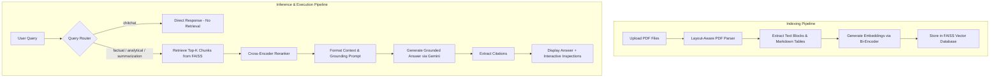

# 🧠 Adaptive Retrieval-Augmented Generation (Adaptive RAG) System

An advanced, layout-aware multi-document QA system and scientific research assistant. This project combines LLM-driven query routing, dense vector database indexing (FAISS), Cross-Encoder reranking, and grounded answer generation with automatic citation extraction. It features a premium, responsive Web UI dashboard and a real-time explainability pipeline inspector.

---

## 🚀 Key System Features

1. **Layout-Aware PDF Parser (`core/parser.py`)**
   - Parses documents page-by-page using `PyMuPDF` (fitz).
   - Detects and converts tables into clean Markdown representations to preserve structural context.
   - Filters out text blocks that overlap with table coordinates to avoid redundant information.
   - Retains page number, content type (text vs. table), and bounding box coordinate metadata for grounding.

2. **Adaptive Query Routing (`core/router.py`)**
   - Employs a lightweight LLM (`gemini-flash-lite-latest`) to classify the user's intent:
     - `factual`: Specific requests for facts, numbers, or details in the document (retrieves top-12 chunks, reranks to top-4).
     - `analytical`: Structural comparisons, data aggregates, or trends (retrieves top-16 chunks, reranks to top-6).
     - `summarization`: Broad overviews of documents or long sections (retrieves top-25 chunks, reranks to top-10).
     - `chitchat`: Greetings and general conversation (skips retrieval entirely to save API tokens and latency).
   - Features a rule-based **Local Fallback Classifier** if no `GEMINI_API_KEY` is provided.

3. **Dual-Stage Dense Retrieval & Reranking**
   - **Stage 1 (Bi-Encoder Retrieval - `core/indexer.py`):** Uses Sentence-Transformers to compute embeddings stored in a flat FAISS Inner Product index (`IndexFlatIP`) with L2 normalization (equivalent to Cosine Similarity). Supports dynamic swapping between a general-purpose model (`all-MiniLM-L6-v2`) and a domain-specific model (`gsarti/scibert-nli`).
   - **Stage 2 (Cross-Encoder Reranking - `core/reranker.py`):** Scores similarity between query-chunk pairs using `cross-encoder/ms-marco-MiniLM-L-6-v2` to filter false positives and order results by relevance confidence.

4. **Grounded Generation & Citations (`core/generator.py`)**
   - Feeds the top reranked chunks to the generator to craft answers backed only by the document context.
   - Enforces a strict formatting prompt that appends citations in the format `[DocumentName: Page PageNum]`.
   - Parses the generated text to extract citation metadata, allowing the UI to highlight source pages.
   - Provides a comprehensive offline mock fallback when no `GEMINI_API_KEY` is present.

5. **Scientific Paper Workbench (`app.py`)**
   - **Insight Extractor:** Automatically extracts structured academic metadata (Title, Problem Statement, Methodology, Key Results, and Contributions) from PDFs.
   - **Literature Review Synthesis:** Selects and compares multiple papers side-by-side, generating a markdown comparison table and a synthesized literature review paragraph.

6. **Interactive Dashboard & Pipeline Inspector (`static/`)**
   - Premium Web UI with glassmorphism styling, animated background orbs, and workspace modes.
   - **Pipeline Status Bar:** Highlights active steps in the pipeline (Router ➔ Retrieving ➔ Reranking ➔ Grounding) in real-time.
   - **Pipeline Inspection Panel:** Displays the routing decision (intent, retrieval flag, reasoning), lists verified sources, and shows a comparison of Bi-Encoder vs. Cross-Encoder scores.

---

## 📐 System Pipeline Architecture

The workflow for indexing documents and answering user queries:



---

## 📂 Repository Structure

```text
├── core/
│   ├── indexer.py         # FAISS Indexing, Bi-Encoder Search & Model Config
│   ├── parser.py          # PyMuPDF Layout-Aware Parser & Markdown Table Extractor
│   ├── reranker.py        # Cross-Encoder Reranking (MiniLM-L-6)
│   ├── router.py          # Intent Routing (Gemini/Local Fallback)
│   └── generator.py       # Grounded Generation & Citation Extraction (Gemini/Mock)
├── static/
│   ├── index.html         # Premium Dashboard Frontend Layout
│   ├── style.css          # Modern CSS styling (Glassmorphism & animations)
│   ├── script.js          # UI Event handlers, API calls, and pipeline renderers
│   └── acme_report.pdf    # Default sample document for quick start
├── uploads/               # Temporary storage for uploaded PDF files
├── .env                   # Configuration file (API Keys)
├── app.py                 # FastAPI Application Server & API Endpoints
├── requirements.txt       # Python Dependencies
├── test_endpoints.py      # Automated API integration test script
└── README.md              # Project Documentation (this file)
```

---

## 🛠️ Setup & Installation

### 1. Prerequisites
- Python 3.8 or higher installed on your system.

### 2. Clone & Prepare Directory
Clone this repository to your local machine and navigate to the project folder:
```bash
git clone <your-github-repo-url>
cd adaptive_rag_system
```

### 3. Create a Virtual Environment (Optional but Recommended)
```bash
python -m venv venv
# On Windows:
.\venv\Scripts\activate
# On macOS/Linux:
source venv/bin/activate
```

### 4. Install Dependencies
```bash
pip install -r requirements.txt
```

### 5. Configure Environment Variables
Create a file named `.env` in the root of the project directory and add your Google Gemini API key:
```env
GEMINI_API_KEY=your_actual_gemini_api_key_here
```
> [!NOTE]  
> If no API key is specified, the system will run in **offline/demo mode**. It will use a local keyword-based router and generate placeholder answers with mock citations in the UI so you can test the interface offline.

---

## 🚀 How to Run the System

### 1. Start the FastAPI Server
Run the application using Uvicorn:
```bash
uvicorn app:app --reload
```
The server will start at `http://127.0.0.1:8000`.

### 2. Verify with the Test Script
You can verify that all backend endpoints are functioning properly by running the automated integration script:
```bash
python test_endpoints.py
```
This script will upload the sample `acme_report.pdf`, extract structured insights, generate comparisons, and test model swapping.

### 3. Access the Web Dashboard
Open your browser and navigate to:
```url
http://127.0.0.1:8000/
```

---

## 📡 API Endpoint Reference

| Endpoint | Method | Payload / Form-Data | Description |
| :--- | :---: | :--- | :--- |
| `/upload` | `POST` | `files: List[UploadFile]` | Uploads PDF files, parses text/tables, and indexes them in FAISS. |
| `/query` | `POST` | `{"query": str, "history": list}` | Routes query, performs RAG pipeline, and generates cited answer. |
| `/documents` | `GET` | *None* | Lists filenames of all currently indexed documents. |
| `/clear` | `POST` | *None* | Wipes all uploaded PDFs from disk and clears the FAISS index. |
| `/set-model` | `POST` | `{"model_name": "MiniLM" \| "SciBERT"}` | Swaps embedding model and re-indexes all uploaded documents. |
| `/extract-insights` | `POST` | `{"filename": str}` | Extracts Title, Problem, Method, Results, and Contributions from a paper. |
| `/compare-papers` | `POST` | `{"filenames": List[str]}` | Generates a literature review table and synthesis for selected papers. |

---

## 🎨 Walkthrough of UI Dashboards

### 💬 Chat RAG Mode
1. **Upload Documents:** Drag and drop or click the upload zone in the sidebar. Once uploaded, the documents are processed and shown under **Indexed Corpus**.
2. **Select Embeddings:** Choose between `MiniLM` (fast, general-purpose) and `SciBERT` (designed for scientific papers). Swapping models triggers automatic re-indexing.
3. **Ask Questions:** Type your query. Watch the **Pipeline Status Bar** update in real-time.
4. **Pipeline Inspector (Right Panel):**
   - Inspect the router's classification intent and reasoning.
   - Click on the interactive **Verified Sources** buttons to view the exact text or markdown table extracted from that page.
   - Look at the **Chunk Score Inspector** to compare Bi-Encoder similarity scores with Cross-Encoder confidence ratings.

### 🔬 Research Assistant Mode
1. **Structured Insights:** Select an indexed paper from the dropdown. The system will parse the layout, extract academic components, and display them in a structured card.
2. **Literature Matrix Synthesis:** Click **Compare Uploaded Papers** to run a comparative analysis across the corpus. The system will compile the results and display a Markdown literature review matrix and synthesis.

---

## 🛡️ License

This project is licensed under the MIT License. Feel free to modify and build upon it!
